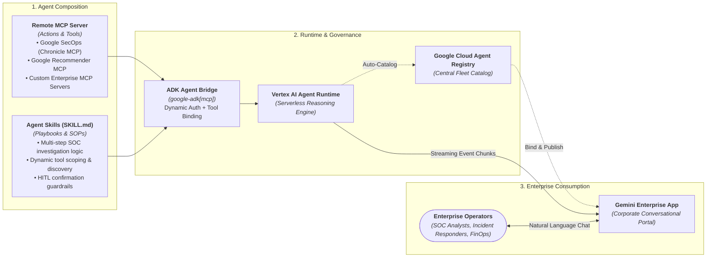

# Google Cloud Remote MCP Bridge to Gemini Enterprise

A production-ready reference architecture connecting **Model Context Protocol (MCP) servers** and **Agent Skills** to **Gemini Enterprise** and **Vertex AI Agent Runtime (Reasoning Engine)** using the **Google Agent Development Kit (ADK)**.

---

## The Vision: Combining MCP Servers with Skills in Gemini Enterprise

An enterprise AI assistant requires two distinct, complementary dimensions to deliver dependable business value:
1. **The "Hands" (Tool Execution)**: Provided by the **Model Context Protocol (MCP)**. Remote MCP servers expose standardized, discoverable APIs, databases, and services to LLMs via JSON-RPC contracts (`tools/list` and `tools/call`).
2. **The "Playbook" (Domain Intelligence)**: Provided by **Agent Skills (`SKILL.md`)**. Skills codify domain expertise, standard operating procedures (SOPs), multi-step investigation logic, mathematical reasoning formulas, output formatting contracts, and guardrails.

By pairing an **MCP Server** with an **Agent Skill** inside the **Google Agent Development Kit (ADK)** and hosting it on **Vertex AI Agent Runtime**, we create a governed, enterprise-grade AI teammate surfaced directly in **Gemini Enterprise**—where employees and teams collaborate daily.



### Value Proposition

- **Democratizing Enterprise Operations**: Enables security analysts, incident responders, and cloud engineers to inspect, investigate, and remediate alerts and infrastructure using conversational natural language.
- **Universal Blueprint (Google SecOps, Recommender, or Custom MCP)**:
  - Connect to **Google SecOps (Chronicle Remote MCP)** for autonomous SIEM/SOAR threat investigation, atomic runbooks, and incident playbooks.
  - Connect to **Google Recommender Remote MCP** for automated cost optimization and idle resource remediation.
  - Connect to **any custom remote MCP server** (internal enterprise microservices, ServiceNow, Jira, CMDB) with identical runtime and publishing mechanics.
- **Automated Fleet Governance**: Deploying to Agent Runtime automatically registers your agent in **Google Cloud Agent Registry**.
- **Dynamic Skill-Based Tool Scoping**: Avoids token bloat and schema depth limitations by dynamically filtering over 70 available remote tools based on YAML frontmatter definitions.

---

## Why Wrap an MCP Server with a Skill? (Skill vs. Raw MCP Server)

Exposing a raw MCP server directly to an LLM provides tools without context. Wrapping the MCP server with an **Agent Skill (`SKILL.md`)** transforms raw endpoints into a trusted colleague:

| Dimension | Exposing Raw MCP Server Directly | Wrapping MCP Server with an Agent Skill (`SKILL.md`) |
| :--- | :--- | :--- |
| **Operational Playbook (SOPs)** | **Absent**: Model sees flat functions (`summarize_entity`, `list_rules`) without knowing execution sequence or scoping rules. | **Deterministic**: Skill establishes standard operating procedures: scoping entity types, verifying threat feeds, checking rules, and ranking findings. |
| **Data Interpretation** | **Unstructured**: Raw multi-megabyte JSON payloads lead to hallucinated summaries or unformatted dumps. | **Contextual Synthesis**: Skill directs extraction of key indicators, verdicts, severity scores, and executive Markdown tables. |
| **Actionable Remediation** | **Passive**: Highlights issues without verified paths to resolve them. | **Actionable Solutions**: Generates tested CLI commands, firewall blocks, or remediation steps with safety notices. |
| **Guardrails & Safety** | **Uncontrolled**: Risk of accidental mutations (closing cases, dropping rules) or parameter hallucinations. | **Strictly Governed**: Enforces read-only defaults and requires explicit human confirmation before mutating actions. |

---

## Project Structure

```text
google-cloud-mcp-bridge/
├── gcp_agent/                     # ADK Agent package
│   ├── __init__.py                # Exports root_agent for ADK loader
│   └── agent.py                   # ADK Agent with McpToolset & Reasoning Engine routes
├── skills/
│   ├── recommender/
│   │   └── SKILL.md               # Cost and idle resource optimization skill
│   └── secops/                    # Google SecOps / Chronicle Remote MCP skills
│       ├── SKILL.md               # Root SOC Lead Analyst & Triage Orchestrator
│       ├── TEMPLATE.md            # Canonical skill specification & schema contract
│       ├── chatops/               # Incident communication & HITL case management
│       ├── ioc-enrichment/        # Threat intelligence & indicator verification
│       ├── malware-triage/        # Malware payload analysis & YARA rule matching
│       ├── runbooks/              # Atomic entity investigation runbooks
│       │   ├── domain/SKILL.md    # Domain reputation, DNS resolution, WHOIS age
│       │   ├── hash/SKILL.md      # Hash verification, malware family matching
│       │   ├── ip-address/SKILL.md# IP routing, ASN correlation, threat feeds
│       │   ├── url/SKILL.md       # URL structure decomposition, phishing heuristics
│       │   └── user/SKILL.md      # Identity compromise, impossible travel
│       └── playbooks/             # End-to-end incident response playbooks
│           ├── compromised-account/SKILL.md # Identity containment & session revocation
│           ├── investigation-report/SKILL.md# Executive briefs & incident chronologies
│           ├── phishing-response/SKILL.md   # Phishing lure triage & purge proposals
│           └── ransomware-response/SKILL.md # Containment protocols & C2 blocks
├── scripts/
│   ├── deploy.sh                  # Deploy to Agent Runtime & catalog in Agent Registry
│   ├── test_client.py             # Verify ADK McpToolset discovery
│   └── test_chat.py               # Local conversational runner via ADK
├── docs/
│   ├── architecture.md            # System architecture, scoping, and limits mitigation
│   ├── setup.md                   # Installation, IAM prerequisites, and environment setup
│   └── secops.md                  # Detailed SecOps skills, tool mappings, and HITL guide
├── tests/
│   ├── test_basic.py              # CLI and catalog sanity tests
│   ├── test_skills.py             # Automated skill schema & tool validity test suite
│   └── test_integration.py       # Live integration tests against Vertex AI Reasoning Engine
├── justfile                       # Standardized command recipes
├── manage.py                      # Typer CLI management interface
├── agents-cli-manifest.yaml       # Deployment target and environment bindings
├── pyproject.toml                 # Ruff and Mypy configuration
└── requirements.txt               # Dependencies (google-adk[mcp,gcp], typer, rich)
```

---

## Google SecOps (Chronicle Remote MCP) Integration

When configured with `ACTIVE_MCP_SERVICE="secops"`, the bridge connects directly to Chronicle Remote MCP (`https://chronicle.googleapis.com/mcp`).

### 13 Cataloged Skills, Runbooks, and Playbooks

| Category | Skill / Runbook | Primary Role | Allowed Remote MCP Tools |
| :--- | :--- | :--- | :--- |
| **Orchestrator** | **Root Analyst** | Lead SOC Analyst & Orchestrator | `list_rules`, `get_rule`, `get_rule_detections`, `list_security_alerts`, `get_security_alert`, `summarize_entity`, `search_entity`, `get_ioc_matches`, `list_cases`, `get_case`, `add_case_comment`, `list_reference_lists` |
| **Functional** | **IOC Enrichment** | Threat Intelligence Analyst | `summarize_entity`, `search_entity`, `get_ioc_matches`, `list_reference_lists` |
| **Functional** | **Malware Triage** | Tier 2 Malware Responder | `summarize_entity`, `search_entity`, `list_rules`, `get_rule_detections`, `list_security_alerts`, `get_security_alert` |
| **Functional** | **ChatOps & HITL** | Incident Commander / Collaboration | `list_cases`, `get_case`, `update_case`, `close_case`, `add_case_comment` |
| **Atomic Runbook** | **Domain Runbook** | SOC Analyst (Domain Specialist) | `summarize_entity`, `search_entity`, `get_ioc_matches` |
| **Atomic Runbook** | **IP Runbook** | SOC Analyst (Network Specialist) | `summarize_entity`, `search_entity`, `get_ioc_matches` |
| **Atomic Runbook** | **Hash Runbook** | SOC Analyst (Payload Specialist) | `summarize_entity`, `search_entity`, `list_rules`, `get_rule_detections` |
| **Atomic Runbook** | **URL Runbook** | SOC Analyst (Web Specialist) | `summarize_entity`, `search_entity`, `get_ioc_matches` |
| **Atomic Runbook** | **User Runbook** | SOC Analyst (Identity Specialist) | `summarize_entity`, `search_entity`, `list_security_alerts`, `get_security_alert` |
| **Playbook** | **Compromised Account**| Incident Responder (Identity) | `summarize_entity`, `search_entity`, `list_security_alerts`, `get_security_alert`, `list_cases`, `get_case`, `add_case_comment` |
| **Playbook** | **Ransomware Response**| Incident Commander (Forensics) | `summarize_entity`, `search_entity`, `list_rules`, `get_rule_detections`, `list_security_alerts`, `get_security_alert`, `list_cases`, `get_case`, `update_case`, `add_case_comment` |
| **Playbook** | **Phishing Response** | SOC Analyst (Phishing Triage) | `summarize_entity`, `search_entity`, `get_ioc_matches`, `list_security_alerts`, `get_security_alert`, `list_cases`, `get_case`, `add_case_comment` |
| **Playbook** | **Investigation Report**| Lead Analyst & Technical Writer | `list_cases`, `get_case`, `add_case_comment`, `summarize_entity`, `search_entity`, `list_security_alerts` |

For in-depth operational protocols, HITL guardrails, and sample prompts, see [docs/secops.md](docs/secops.md).

---

## Quickstart

### 1. Environment Initialization
Run the initialization recipe to provision a virtual environment in `.venv`, install dependencies via `uv`, and generate `.env` from template:
```bash
just setup
```

### 2. Configure Environment Variables
Edit `.env` to configure your target project:
```bash
# Service selection: 'secops' (default) or 'recommender'
ACTIVE_MCP_SERVICE="secops"

# Google Cloud settings
GOOGLE_CLOUD_PROJECT="your-project-id"
GOOGLE_CLOUD_LOCATION="us-central1"
GOOGLE_GENAI_USE_VERTEXAI="true"
GEMINI_MODEL="gemini-2.5-flash"
```

### 3. Authenticate Application Default Credentials
```bash
gcloud auth application-default login
```

### 4. Verify Remote MCP Tool Discovery
Verify that the ADK `McpToolset` successfully discovers remote endpoints and filters them according to active skills:
```bash
just client
```

### 5. Run Interactive Conversational Prompts
Test conversational reasoning locally using the ADK Runner:
```bash
# SecOps prompt:
just chat "Investigate domain evil-sample.com for active IOC matches and summarize findings."

# Recommender prompt (when ACTIVE_MCP_SERVICE="recommender"):
just chat "What recommendations can you provide for persistent disks?"
```

### 6. Run Quality Gates
Verify tests, linting, and type checking:
```bash
just unit-test
just lint
just typecheck
```

---

## Deployment & Production Execution

### Deploy to Vertex AI Agent Runtime
Deploy the agent directly to Vertex AI Agent Runtime (Reasoning Engine):
```bash
just deploy
```
This script automatically:
1. Sources `.env` and validates credentials.
2. Applies the schema flattener bypass (`FeatureName.JSON_SCHEMA_FOR_FUNC_DECL = False`).
3. Provisions a serverless Reasoning Engine deployment.
4. Catalogs the agent in Google Cloud Agent Registry.

### Execute Live Integration Tests
Validate live end-to-end reasoning against the deployed Reasoning Engine:
```bash
just integration-test
```

### Publish to Gemini Enterprise
Bind your deployed agent to a corporate Gemini Enterprise Chat App:
```bash
agents-cli publish gemini-enterprise \
  --gemini-enterprise-app-id="projects/PROJECT_NUMBER/locations/global/collections/default_collection/engines/APP_ID" \
  --display-name="Google SecOps SOC Assistant" \
  --description="Autonomous security operations assistant powered by Chronicle Remote MCP." \
  --tool-description="Investigates IOCs, triages alerts, and executes incident response playbooks." \
  --deployment-target="agent_runtime" \
  --registration-type="adk"
```

---

## Command Reference (`just`)

The project provides a comprehensive task runner via `just`:

| Command | Description |
| :--- | :--- |
| `just setup` | Provision virtual environment, install dependencies, and create `.env` |
| `just client` | Verify remote MCP connection and tool discovery via `scripts/test_client.py` |
| `just chat [prompt]` | Run conversational prompt against ADK runner via `scripts/test_chat.py` |
| `just deploy` | Deploy agent to Vertex AI Agent Runtime via `scripts/deploy.sh` |
| `just serve` | Start local FastAPI agent server with Uvicorn on port 8080 |
| `just unit-test` | Run unit tests across all skill definitions, frontmatter schemas, and tools |
| `just integration-test`| Run live integration tests against deployed Reasoning Engine |
| `just lint` | Run Ruff linter and format checking |
| `just format` | Auto-format source files with Ruff |
| `just typecheck` | Run Mypy static type analysis across all packages and scripts |
| `just clean` | Remove build artifacts, bytecode, and test caches |

---

## Documentation Links

- [Architecture Overview](docs/architecture.md): Technical components, dynamic scoping mechanics, and Vertex AI mitigations.
- [Setup & Installation](docs/setup.md): Complete prerequisites, IAM role assignments, and environment configuration.
- [Google SecOps Guide](docs/secops.md): Comprehensive catalog of the 13 SecOps skills, tool mappings, and HITL guardrails.
