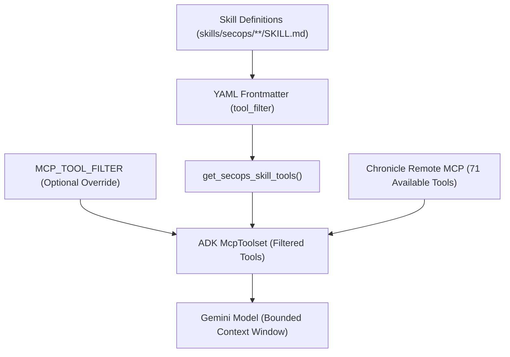

# Architecture Overview - google-cloud-mcp-bridge

## System Overview

`google-cloud-mcp-bridge` provides a direct bridge between the Google Agent Development Kit (ADK) and Google Cloud Remote Model Context Protocol (MCP) Server endpoints without requiring custom JSON-RPC transport code.

```text
User / App Prompt
       │
       ▼
 ┌───────────────┐
 │   ADK Agent   │  (FastAPI server / CLI runner / Vertex AI Reasoning Engine)
 └───────┬───────┘
         │
         ▼  (Native ADK McpToolset + Dynamic Tool Filter)
 ┌───────────────┐
 │  Streamable   │  (StreamableHTTPConnectionParams + GoogleAuthRequest)
 │  HTTP Client  │
 └───────┬───────┘
         │
         ▼  (Google OAuth2 / ADC Bearer Token)
 ┌─────────────────────────────────────────────────────────────┐
 │  Google Cloud Remote MCP Server Endpoints                   │
 │                                                             │
 │  - secops:      https://chronicle.googleapis.com/mcp        │
 │  - recommender: https://recommender.googleapis.com/mcp     │
 │  - compute:     https://compute.googleapis.com/mcp         │
 │  - bigquery:    https://bigquery.googleapis.com/mcp        │
 │  - billing:     https://cloudbilling.googleapis.com/mcp    │
 │  - run:         https://run.googleapis.com/mcp             │
 │  - storage:     https://storage.googleapis.com/storage/mcp │
 └─────────────────────────────────────────────────────────────┘
```

---

## Component Boundaries

- `gcp_agent/agent.py`:
  - Core entrypoint exposing `root_agent` and FastAPI routes (`/query`, `/stream_query`).
  - Instantiates `StreamableHTTPConnectionParams` targeting the configured `ACTIVE_MCP_SERVICE`.
  - Injects `GoogleAuthRequest` for automatic Google OAuth2 ADC bearer token generation and refresh.
  - Dynamically scopes tool definitions via `get_secops_skill_tools()` to prevent token bloat.
  - Mitigates Vertex AI schema flattener limits by disabling `FeatureName.JSON_SCHEMA_FOR_FUNC_DECL`.
- `skills/`:
  - Hierarchical skill specifications conforming to `skills/secops/TEMPLATE.md`.
  - Each skill specifies YAML frontmatter (`name`, `description`, `role`, `category`, `tool_filter`, `inputs`, `outputs`) and standard markdown operational protocols.
- `manage.py`:
  - Typer-powered CLI interface providing local operations: `info`, `client`, `chat`, `serve`, and `deploy`.
- `scripts/`:
  - Deployment and testing automation:
    - `scripts/deploy.sh`: Packages and deploys to Vertex AI Agent Runtime (Reasoning Engine) and registers the agent with Google Cloud Agent Registry.
    - `scripts/test_client.py`: Verifies MCP connection and inspects available tool declarations.
    - `scripts/test_chat.py`: Executes conversational prompts locally via the ADK Runner.
- `agents-cli-manifest.yaml`:
  - Deployment manifest defining target runtime, regions, and environment variable bindings.
- `tests/`:
  - Comprehensive test suite covering basic connectivity, skill frontmatter schemas, tool filter validity, markdown section completeness, and live integration against Vertex AI Reasoning Engine.

---

## Dynamic Skill-Based Tool Scoping

Google Cloud Remote MCP servers like Chronicle (`secops`) expose dozens of fine-grained tools (over 70 distinct endpoints across SIEM and SOAR). Exposing all tools simultaneously into model prompt memory causes severe token overhead, latency spikes, and schema compilation issues.

`google-cloud-mcp-bridge` solves this through **Dynamic Skill-Based Tool Scoping**:



1. **Frontmatter Aggregation**:
   - `get_secops_skill_tools()` scans all skill definitions under `skills/secops/` recursively.
   - Extracts the `tool_filter` lists and aggregates a unique, deduplicated list of required tools.
2. **Environment Variable Override**:
   - If `MCP_TOOL_FILTER` is explicitly set in `.env`, it takes precedence, allowing targeted tool subsets during debugging or focused tasks.
3. **Progressive Skill Discovery**:
   - `load_instructions()` injects a high-level "Specialized Sub-Skills Catalog" into the agent's system prompt.
   - The model learns which specialized skills exist and when to invoke their corresponding reasoning protocols without needing all tool schemas in every turn.

---

## Vertex AI Agent Runtime Schema Limit Mitigation

When deploying large MCP toolsets to Vertex AI Agent Runtime (Reasoning Engine), the platform's schema compiler converts tool parameters into function declarations. Complex, highly nested OpenAPI schemas can exceed Vertex AI's flattener limits, resulting in deployment failures or model invocation errors.

`gcp_agent/agent.py` applies the following mitigation:

```python
from google.adk.features import FeatureName, disable_feature

# Mitigate Vertex AI schema flattener depth limitations for large MCP toolsets
disable_feature(FeatureName.JSON_SCHEMA_FOR_FUNC_DECL)
```

This ensures tool schemas are passed directly in native format without triggering vertex-level flattener recursion errors.

---

## SecOps Skill Hierarchy

The SecOps skill catalog is organized into a four-tier operational hierarchy:

1. **Root Orchestrator** (`skills/secops/SKILL.md`):
   - Acts as the primary SOC triage analyst and incident commander.
   - Coordinates multi-entity investigations and routes to specialized runbooks.
2. **Functional Capabilities**:
   - `ioc-enrichment`: Indicator verification across Chronicle threat intelligence and reference lists.
   - `malware-triage`: Executable and payload analysis, detection rule matching, and behavioral indicators.
   - `chatops`: Incident communication, SOAR case updates, and human-in-the-loop approvals.
3. **Atomic Investigation Runbooks** (`skills/secops/runbooks/`):
   - `domain`: Domain reputation, WHOIS age, DNS records, and sinkhole checks.
   - `ip-address`: IP routing, ASN context, threat feeds, and internal vs. external telemetry.
   - `hash`: File hash lookup, malware family classification, and YARA rule verification.
   - `url`: URL decomposition, path analysis, and credential harvesting patterns.
   - `user`: Identity compromise, impossible travel, and privilege escalation indicators.
4. **Incident Response Playbooks** (`skills/secops/playbooks/`):
   - `compromised-account`: Identity containment, session revocation proposals, and user audit trails.
   - `ransomware-response`: Emergency containment protocol, shadow copy monitoring, and C2 blocking.
   - `phishing-response`: Email header analysis, credential lure triage, and purge proposals.
   - `investigation-report`: Executive summaries, technical incident chronologies, and SOAR case logging.
